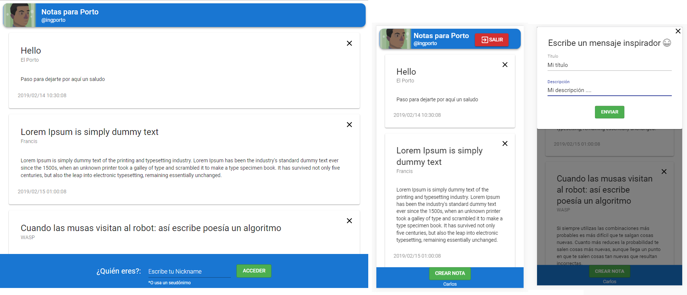

# React Firebase Notas
You can create a note with a nickname and publish in a time line. Aplication made with ReactJS and Firebase.


## Installation

```bash
$ npm install
```
```bash
$ npm start
```

## Global access

[https://ingportonotas.now.sh/](https://ingportonotas.now.sh/)


## Preveiw
###### Desktop - Mobile (with nickname access) - Mobile (adding a new note)



## Modules

* `react-scripts` scripts and configuration used by create-react-app 
* `firebase` client of firebase web 
* `@material-ui/core` material design framework
* `date-and-time` set format to dates

#### Note
> In a future, to change `date-and-time` for `date-fns`, it's more light
